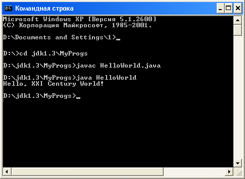

## Встроенные типы данных, операции над ними.

### Приступая к изучению нового языка, полезно знать, какие исходные данные могут обрабатываться средствами этого языка, в каком виде их можно задавать, и какие стандартные средства обработки этих данных заложены в язык. Перечислим примитивные типы данных, операции над ними. 

Первая программа на Java
Для базового понимания синтаксиса языка лучше начать с программы "Hello, World!". В листинге 1.1 эта программа в самом простом виде, записанная на языке Java.
Листинг 1.1. Первая программа на языке Java;
```
class HelloWorld {
public static void main(String[] args){ 
    System.out.println("Hello, XXI Century World!"); 
    } 
}
```

На этом простом примере можно заметить целый ряд существенных особенностей языка Java.
-	Всякая программа представляет собой один или несколько классов, в этом простейшем примере только один класс (class).
-	Начало класса отмечается служебным словом class, за которым следует имя класса, выбираемое произвольно, в данном случае Helloworld. Все, что содержится в классе, записывается в фигурных скобках и составляет тело класса (class body).
-	Все действия производятся с помощью методов обработки информации, 
-	Методы различаются по именам. Один из методов обязательно должен называться main, с него начинается выполнение программы. 
-	Как и положено функции, метод всегда выдает в результате (чаще говорят, возвращает (returns)) только одно значение, тип которого обязательно указывается перед именем метода. Метод может и не возвращать никакого значения, играя роль процедуры, как в нашем случае. Тогда вместо типа возвращаемого значения записывается слово void, как это и сделано в примере. 
-	После имени метода в скобках, через запятую, перечисляются аргументы (arguments) -или параметры метода. Для каждого аргумента указывается его тип и, через пробел, имя. В примере только один аргумент, его тип — массив, состоящий из строк символов. Строка символов — это встроенный в Java API тип string, а квадратные скобки — признак массива. Имя массива может быть произвольным, в примере выбрано имя args. 
-	Перед типом возвращаемого методом значения могут быть записаны модификаторы (modifiers). В примере их два: слово public означает, что этот метод доступен отовсюду; слово static обеспечивает возможность вызова метода main () в самом начале выполнения программы. Модификаторы вообще необязательны, но для метода main () они необходимы. 

Единственное действие, которое выполняет метод main () в примере, заключается в вызове другого метода со сложным именем System.out.println и передаче ему на обработку одного аргумента, текстовой константы "Hello, 2lth century world!". Текстовые константы записываются в кавычках, которые являются только ограничителями и не входят в состав текста.
Действие метода println () заключается в выводе своего аргумента в выходной поток, связанный обычно с выводом на экран текстового терминала, в окно MS-DOS Prompt или Command Prompt или Xterm, в зависимости от вашей системы. После вывода курсор переходит на начало следующей строки экрана, на что указывает окончание ln, слово println — сокращение слов print line. В составе Java API есть и метод print (), оставляющий курсор в конце выведенной строки. Разумеется, это прямое влияние языка Pascal.
Сделаем сразу важное замечание. Язык Java различает строчные и прописные буквы, имена main, Main, MAIN различны с "точки зрения" компилятора Java. В примере важно писать String, System с заглавной буквы, a main с маленькой. Но внутри текстовой константы неважно, писать Century или century, компилятор вообще не "смотрит" на нее, разница будет видна только на экране.
Замечание: Язык Java различает прописные и строчные буквы.
Свои имена можно записывать как угодно, можно было бы дать классу имя helloworid или helloworid, но между Java-программистами заключено соглашение, называемое "Code Conventions for the Java Programming Language".
Вот несколько пунктов этого соглашения:
-	имена классов начинаются с прописной буквы; если имя содержит несколько слов, то каждое слово начинается с прописной буквы; 
-	имена методов и переменных начинаются со строчной буквы; если имя содержит несколько слов, то каждое следующее слово начинается со строчной буквы; 
-	имена констант записываются полностью прописными буквами; если имя состоит из нескольких слов, то между ними ставится знак подчеркивания. 
Конечно, эти правила необязательны, но сильно облегчают понимание кода и придают программе характерный для Java стиль.
Итак, программа написана в каком-либо текстовом редакторе, например, Notepad. Теперь ее надо сохранить в файле, имя которого совпадает с именем класса, содержащего метод main (), и дать имени файла расширение Java. Это правило очень желательно выполнять. При этом система исполнения Java будет быстро находить метод main() для начала работы, просто отыскивая класс, совпадающий с именем файла.

#### Совет

Называйте файл с программой именем класса, содержащего метод main (), соблюдая регистр букв. 
В нашем примере, сохраним программу в файле с именем HelloWorld.java в текущем каталоге. Затем вызовем компилятор, передавая ему имя файла в качестве аргумента:

`javac HelloWorld.java`

Компилятор создаст файл с байт-кодами, даст ему имя Helloworid.class и запишет этот файл в текущий каталог.
Осталось вызвать интерпретатор, передав ему в качестве аргумента имя класса (а не файла):

`java HelloWorld`

На экране появится:

Hello, 21st Century World!

#### Замечание
Не указывайте расширение class при вызове интерпретатора.
На рис. 1.1 показано, как все это выглядит в окне Command Prompt операционной системы MS Windows 2000.
 
Рис. 1.1. Окно  Command Prompt
При работе в интегрированной среде все эти действия вызываются выбором соответствующих пунктов меню или "горячими" клавишами — единых правил здесь нет.

Комментарии
В текст программы можно вставить комментарии, которые компилятор не будет учитывать. Они очень полезны для пояснений по ходу программы. Комментарии вводятся таким образом: 
-	за двумя наклонными чертами подряд // 
-	за наклонной чертой и звездочкой /* начинается комментарий, который может занимать несколько строк, до звездочки и наклонной черты */ (без пробелов между этими знаками). 
Комментарии очень удобны для чтения и понимания кода, они превращают программу в документ, описывающий ее действия. Именно так создается документация к JDK.
Добавим комментарии к нашему примеру (листинг 1.2).
Листинг 1.2. Первая программа с комментариями
```
/**
* Разъяснение содержания и особенностей программы...
* @author Имя Фамилия (автора)
* @version 1.0 (это версия программы)
*/
class HelloWorld{     // HelloWorld — это только имя 
    // Следующий метод начинает выполнение программы 
    public static void main(String[] args){   
        // args не используются 
        /* Следующий метод просто выводит свой аргумент
        * на экран дисплея */
        System.out.println("Hello, 21st Century World!"); 
        // Следующий вызов закомментирован, 
        // метод не будет выполняться
        // System.out.println("Farewell, 20th Century!"); 
    } 
}
```
Звездочки в начале строк не имеют никакого значения, они написаны просто для выделения комментария. Пример, конечно, перегружен пояснениями (это плохой стиль), здесь просто показаны разные формы комментариев.

Типы данных
-   byte: тип данных байта представляет собой 8-разрядное целое число со знаком в виде двоичного числа со знаком. Он имеет минимальное значение -128 и максимальное значение 127
-	short: тип данных short - это 16-разрядное целое число со знаком в виде двоичного числа со знаком. Он имеет минимальное значение -32 768 и максимальное значение 32 767 (включительно)
-	int: по умолчанию типом данных int является 32-разрядное целое число со знаком, состоящее из двух чисел со знаком, минимальное значение которого равно -231 , а максимальное - 231-1
-	long: тип данных long - это 64-разрядное целое число с дополнением до двух. Подписанный long имеет минимальное значение -263 и максимальное значение of 263-1. 
-	float: тип данных с плавающей запятой – 232-битная с плавающей запятой одинарной точности
-	double: тип данных double представляет собой -263-битную с плавающей запятой двойной точности.
-	boolean: логический тип данных имеет только два возможных значения: true и false.
-	char: тип данных char представляет собой один 16-битный символ Unicode. Он имеет минимальное значение «\ u0000» (или 0) и максимальное значение «\ uffff» (или 65 535 включительно).

## Арифметические операторы в Java

Для стандартных арифметических операций, таких как сложение, вычитание, умножение, деление в Java используются традиционные символы, к которым мы привыкли со школы:

```
int a, b;
int sum = a + b;
int sub = a - b;
int mult = a * b;
int div = a / b;
```

**Примечание:** при операции деления, если оба аргумента являются целыми числами, то в результате получим целое число. Дробная часть, если такая имеется, отбросится. Если хотим получить число с дробной частью, то нужно, чтобы один из аргументов был типа double. Это можно указать в самом выражении при помощи добавления после числа .0 или .d. Пример:
```
System.out.println (18 / 5); // на консоль выведет число 3
double div = 18 / 5;
System.out.println (div); // на консоль выведет число 3.0
System.out.println (18.0 / 5); // на консоль выведет число 3.6
System.out.println (18 / 5.d); // на консоль выведет число
```
В Java также имеется специальный оператор %, обозначающий остаток от делния.

```
int mod;
mod = 15 % 10; // остаток от деления 15 на 10 равно 5, mod = 5
mod = 16 % 2; // mod = 0
mod = 82 % 9; // mod = 1
```

Пример использования: дан массив целых чисел, вывести на консоль только те числа, которые делятся на 3.

```
int[] intArr = {9, 1, 3, 2, 7, 4, 6};
for(int i=0; i< intArr.length; i++){
	if(intArr[i] % 3 == 0){
		System.out.print(intArr[i] + " ");
	}
}
```
## Операции с присваиванием
Рассмотрим задачу вывода на экран 10 первых четных чисел чисел

```
int count=0;
for(int i = 0; i <= 10; i++){
	count = count + 2;
	System.out.println(count);
}
```
строку
```
count += 2;
```
+= это оператор сложения с присваиванием. Подобные операторы есть для всех основных 5 операций, рассмотренных выше
```
int a = 5;
int sum += a; // эквивалентно sum = sum + a;
int sub -= a; // эквивалентно sub = sub - a;
int mult *= a; // эквивалентно mult = mult * a;
int div /= a; // эквивалентно div = div / a;
int mod %= a; // эквивалентно mod = mod % a;
```
Пример использования: Найти факториал числа 7.
```
int n = 7;
int result = 1;
for(int i = 1; i <= n; i ++){
	result *= i; 
}
System.out.print(result);
```

Инкрементирование и декрементирование
Инкремент, обозначается ++ и увеличивает значение переменной на единицу. Декремент обозначается — и уменьшает значение на единицу. С инкрементом и декрементом мы часто встречаемся в цикле for.

Инкремент  и декремент бывают двух форм

Префиксная форма:
```
int k = 3;
++k; // k = 4
--k; // k = 3
```
Постфиксная форма
```
int k = 3;
k++; // k = 4
k--; // k = 3
```
Различие префиксной и постфиксной формы проявляется только  тогда, когда эти операции присутствуют в выражениях. Если форма префиксная, то сначала произойдет увеличение (или уменьшение) переменной на единицу, а потом с новым значением будет произведены дальнейшие вычисления. Если форма постфиксная, то расчет выражения будет происходить со старым значением переменной, а переменная увеличится (или уменьшится) на единицу после вычисления выражения. Пример
```
int a = 3, b = 3;
int prefix = 15 / 3 - ++a; // итог prefix = 1 
int postfix = 15 / 3 - b++; // итог postfix = 2
```
В первом случае сначала переменная a увеличится на 1, потом произойдет вычисление всего выражения. Во втором случае произойдет вычисление выражения при старом значении b = 3, и после вычисления b увеличится на 1, на результат в postfix это уже не повлияет.
```
int a = 3, b = 3;
System.out.println(++a);// на консоль выведет 4
System.out.println(b++);//на консоль выведет 3
```


### Вопросы для самопроверки

1. Какое максимальное число можно задать для переменной типа int ?

2. Можно ли присвоить переменной типа int, значение переменной типа long?

3. Сколько значений имеет логический тип данных?

4. Какие числа будут выведены на экран? Почему? 
```
int x = 3, y = 3;
x = x++ + ++x;
y = --y - y--;
```

Какие операции нужно использовать, чтобы посчитать среднее число от двух заданных?


### Задания:

1. Запустить программу HelloWorld в терминале, как описано в лекции.

2. Написать программу выводящую фразу «Привет все жители Краснодара 899541»

    2.1 Попробовать вывести число после слова Краснодар типа int.

    2.2 Попробовать вывести число типа double.


**[Следующий урок](LESSON2.md)**
